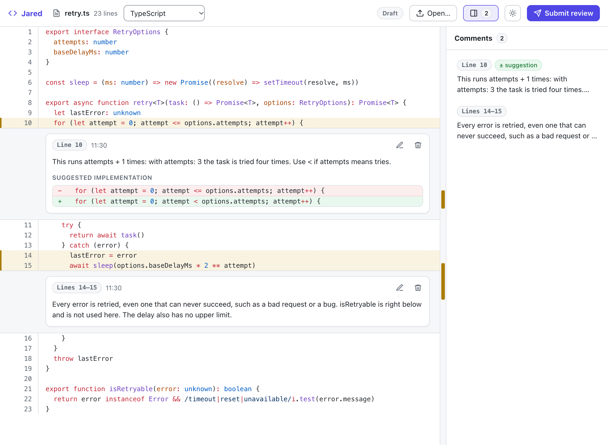
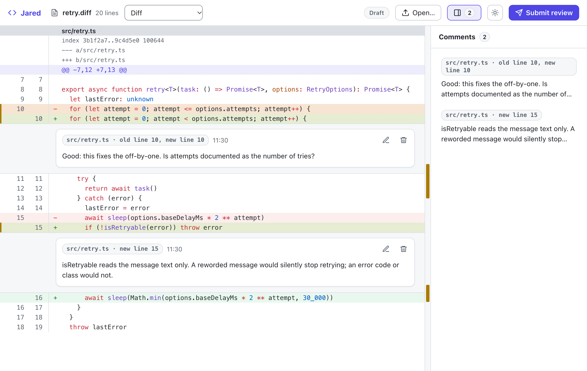

# Jared for Claude Code

Jared /ˈdʒær.əd/ is not Gerrit /ˈɡɛr.ɪt/.

Syntax-highlighted, file-based review for Claude.

A Claude Code plugin. It opens a source file or a diff in Jared, a line-by-line review app, and brings your review back into the session.

## What it looks like

A file in Jared, with two comments. The first has a suggested change.

<picture>
  <source media="(prefers-color-scheme: dark)" srcset="screenshots/review-dark.png">
  
</picture>

A diff is shown as changes. A comment on it says which file it is about, and which lines of the old and the new version.

<picture>
  <source media="(prefers-color-scheme: dark)" srcset="screenshots/diff-dark.png">
  
</picture>

## Requirements

- Claude Code
- a browser
- `sh` and `perl` (macOS and Linux have both)
- a command that reads the clipboard: `pbpaste` on macOS, `wl-paste` or `xclip` on Linux

## Install

In a terminal, add the marketplace from GitHub, then install the plugin:

```bash
claude plugin marketplace add snofla/claude-jared
claude plugin install jared@claude-jared
```

## Use

In a Claude Code session, give the plugin a source file or a diff:

```
/jared:review path/to/file.ts
```

You can also ask in words: "review `path/to/file.ts` in Jared".

Jared opens with your file, in the browser pane of the Claude app if your session has one, and otherwise in your own browser. Write your comments there. How the review comes back depends on which of the two it is.

### In the browser pane of the Claude app

Press **Submit review**. The review goes to the session.

The pane gets Jared from a small service on your computer. It stops by itself after half an hour without use. To stop it sooner, run `/jared:stop`.

### In your own browser

Jared opens from a single file on your computer. It needs no server and no Node.

Press **Export review**, then choose one of two ways:

- **Copy** puts the review on the clipboard. Tell the session that it is there.
- **Download** saves the review as `file.ts.review.json` in your downloads folder. Give the session the path of that file and the path of the source file:

  ```
  /jared:review path/to/file.ts.review.json path/to/file.ts
  ```

## Where Jared runs

The plugin carries a copy of Jared, so nothing else needs to run.

To use a Jared that runs somewhere else, set the plugin setting `jared_url` ("Where Jared runs") to its address. The plugin then opens your file there, for a file of up to about 75 KB. Set it only for a Jared that you run yourself or trust, because the page at that address receives the file that you review.

## Update

In a terminal, update the marketplace and then the plugin, and restart Claude Code:

```bash
claude plugin marketplace update claude-jared
claude plugin update jared@claude-jared
```

What changed in each version is in [CHANGELOG.md](CHANGELOG.md).

## Remove

In a terminal, remove the plugin and then the marketplace:

```bash
claude plugin uninstall jared@claude-jared
claude plugin marketplace remove claude-jared
```

## Source

The copy of Jared in `claude-plugin/app/jared.html` is built from the files in `source/`, so you can build it yourself and compare. You need Node 26 or newer and npm.

```bash
cd source
npm ci
npm run build:single
shasum -a 256 dist-single/jared.html ../claude-plugin/app/jared.html
```

The last command prints one checksum for each file, and the two should be the same. (On Linux, `sha256sum` does the same as `shasum -a 256`.)

GitHub makes the same comparison each time this repository is updated, and shows the result:

[](https://github.com/snofla/claude-jared/actions/workflows/verify.yml)

Only `npm run build:single` works in `source/`: the tests and the other scripts of `package.json` are not in this repository.

This repository is made by a script from the repository where Jared is developed. Every release is published from there, and never from this repository.

## Sending a change

Patches are welcome. A patch that is accepted is merged here and into the repository where Jared is developed, so it stays in the releases that follow.

## License

The plugin and the source of its page are under the MIT license: see [LICENSE](LICENSE). The copy of Jared that it carries contains third-party code and data under their own licenses: see [claude-plugin/THIRD-PARTY-NOTICES.md](claude-plugin/THIRD-PARTY-NOTICES.md).
